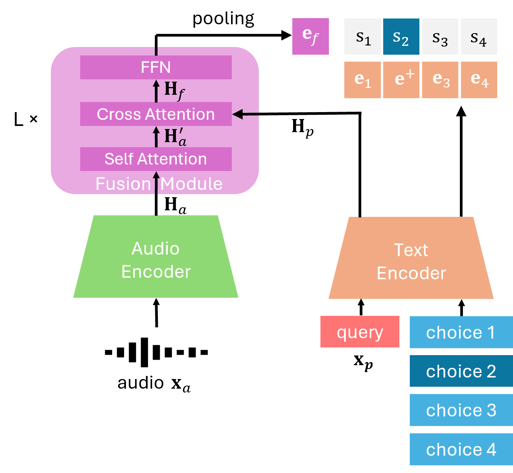

# TP-CLAP

TP-CLAP (Text-Prompted Contrastive Language-Audio Pretraining) extends CLAP with a lightweight cross-attention fusion module that
conditions audio representations on a text prompt. This lets a compact contrastive model (219M
parameters) answer multiple-choice questions about audio and retrieve clips by a specific attribute
(e.g. tempo, instrument) rather than by global similarity.

This repository contains the evaluation scripts to
produce the paper's results. Paper: *Text-Prompted CLAP: Learning
Text-Conditioned Audio Representations via Contrastive Learning*,
[arXiv:2607.25085](https://arxiv.org/abs/2607.25085).

<!-- <p align="center"></p> -->

## Installation

```bash
git clone https://github.com/mohan-li/tp-clap.git
cd tp-clap

conda create -n tp-clap python=3.10 -y
conda activate tp-clap
pip install -r requirements.txt        # or: pip install -e .
```

## Checkpoints

Download the three checkpoints from
[mohanli/TP-CLAP](https://huggingface.co/mohanli/TP-CLAP) into `checkpoints/`:

```bash
mkdir -p checkpoints
huggingface-cli download mohanli/TP-CLAP \
    tp-clap.pt tp-clap_nsynth.pt tp_clap_mtt.pt --local-dir checkpoints
```

- `tp-clap.pt` — base model, used for audio-text retrieval, classification and AQA.
- `tp-clap_nsynth.pt` / `tp_clap_mtt.pt` — fine-tuned for attribute-focused audio-to-audio retrieval
  on NSynth / MagnaTagATune (paper §2.4).

## Usage

```bash
cp configs/datasets.example.yaml configs/datasets.yaml
$EDITOR configs/datasets.yaml            # point each entry at your local copy of the data

python evaluate.py --tasks all           # full benchmark suite
python evaluate.py --tasks esc50 gtzan   # a subset
python evaluate.py --tasks all --output results/tp-clap.json
python evaluate.py --list-tasks          # available benchmarks and their metrics
```

Each task reads its checkpoint from `checkpoints:` in the config (the `a2a_retrieval_*` tasks use
their own fine-tuned weights; everything else uses `checkpoints.default`), unless `--checkpoint`
overrides it. Benchmarks whose dataset paths aren't filled in are skipped rather than failing the
run. Output is grouped by benchmark family (`RETRIEVAL` / `CLASSIFICATION` / `A2A_RETRIEVAL` /
`AQA`), ending with a `CHECKPOINTS` block naming the weights behind each number.

## Results

Numbers reported in the paper for TP-CLAP (Tables 1-5) — see the paper for the CLAP and
CLAP+AudioMCQ ablations and comparisons against other CLAP variants and audio-LLMs.

**Audio-text retrieval** (R@1, %)

| AudioCaps T2A | AudioCaps A2T | Clotho T2A | Clotho A2T |
| --- | --- | --- | --- |
| 42.6 | 57.2 | 21.3 | 27.1 |

**Zero-shot classification** (accuracy, %; mAP for FSD50K)

| ESC-50 | FSD50K | US8K | VocalSound | CREMA-D | GTZAN | Beijing Opera | NSynth | Avg. |
| --- | --- | --- | --- | --- | --- | --- | --- | --- |
| 93.6 | 52.6 | 82.2 | 84.1 | 34.8 | 55.9 | 67.8 | 42.1 | 64.1 |

**Audio question answering** (accuracy, %)

| MMAU Sound | MMAU Music | MMAR Sound | MMAR Music |
| --- | --- | --- | --- |
| 71.47 | 55.99 | 47.88 | 32.02 |

**Attribute-focused audio-to-audio retrieval on NSynth** (%) — `Con.` is the prompt-conditioned
embedding, `Uncon.` the plain one

| Attribute | Setting | P@5 | P@10 | P@20 | mAP |
| --- | --- | --- | --- | --- | --- |
| Instrument | Uncon. | 57.0 | 46.1 | 38.0 | 22.0 |
| Instrument | Con. | 77.8 | 77.6 | 76.3 | 45.0 |
| Pitch | Uncon. | 75.3 | 72.2 | 70.0 | 60.2 |
| Pitch | Con. | 88.0 | 86.8 | 84.3 | 72.2 |
| Source | Uncon. | 65.2 | 56.7 | 51.1 | 39.0 |
| Source | Con. | 78.7 | 78.8 | 78.7 | 58.2 |

**Attribute-focused audio-to-audio retrieval on MagnaTagATune** (%)

| Attribute | Setting | SP@5 | SP@10 | SP@20 | SmAP |
| --- | --- | --- | --- | --- | --- |
| Genre | Uncon. | 65.4 | 64.8 | 64.1 | 55.2 |
| Genre | Con. | 66.3 | 66.4 | 66.3 | 58.0 |
| Instrument | Uncon. | 66.8 | 66.0 | 65.2 | 50.9 |
| Instrument | Con. | 69.7 | 70.0 | 69.5 | 54.9 |
| Tempo | Uncon. | 93.4 | 92.8 | 91.4 | 81.1 |
| Tempo | Con. | 96.5 | 96.5 | 96.6 | 90.2 |

## Citation

```bibtex
@article{li2026tpclap,
  title   = {Text-Prompted {CLAP}: Learning Text-Conditioned Audio Representations via
             Contrastive Learning},
  author  = {Li, Mohan and Doddipatla, Rama and Woodland, Philip C.},
  year    = {2026},
  eprint  = {2607.25085},
  archivePrefix = {arXiv},
  url     = {https://arxiv.org/abs/2607.25085}
}
```
